# InformeTarea2
==========================
## DEBER CAPITULOS 3 Y 4
1. OBJETIVOS
* 1.1. OBJETIVO GENERAL

El objetivo fundamental de este deber  es el conocimiento experimental de los elementos de medida básicos desde el punto de vista eléctrico y su aplicación en circuitos. El conocimiento del papel de las resistencias en los circuitos eléctricos, así como el estudio de la relación existente entre la resistencia eléctrica de un material y sus características intrínsecas.
Se analizará el comportamiento de los conceptos de corriente y resistencia eléctrica y los aplicará a través de la Ley de Ohm. Conocerá el concepto de potencia eléctrica

* 1.2. OBJETIVOS ESPECÍFICOS
  * Lograr identificar y hacer análisis de los fenómenos eléctricos.
  * Conocer el funcionamiento de los elementos eléctricos.
  * Reconocer los elementos que conforman un circuito eléctrico.
  * Comprender el funcionamiento y empleo del voltímetro y el amperímetro. 
  * verificación de la ley de Ohm.

2. MARCO TEÓRICO (RESUMEN)

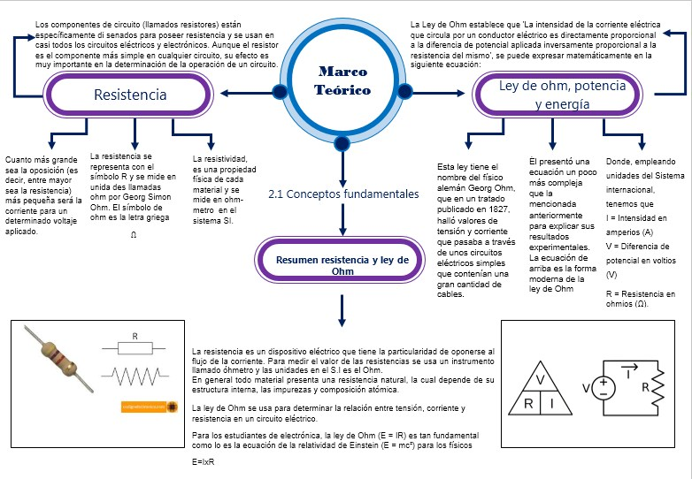

3. EXPLICACIÓN Y RESOLUCIÓN DE EJERCICIOS O PROBLEMAS

Resolución del capitulo 3 (ejercicios impares)

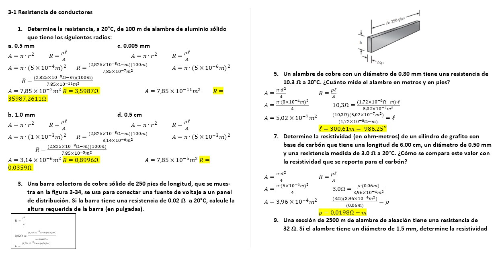
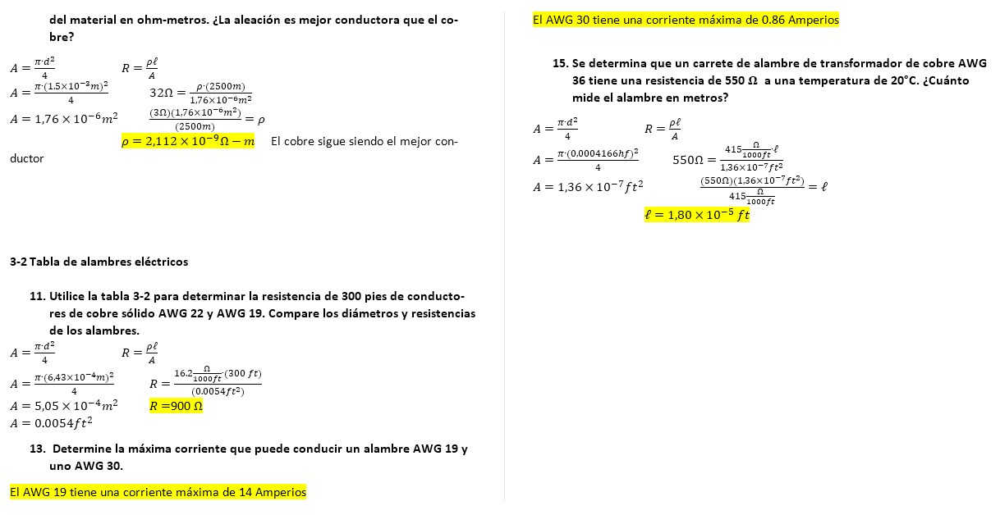
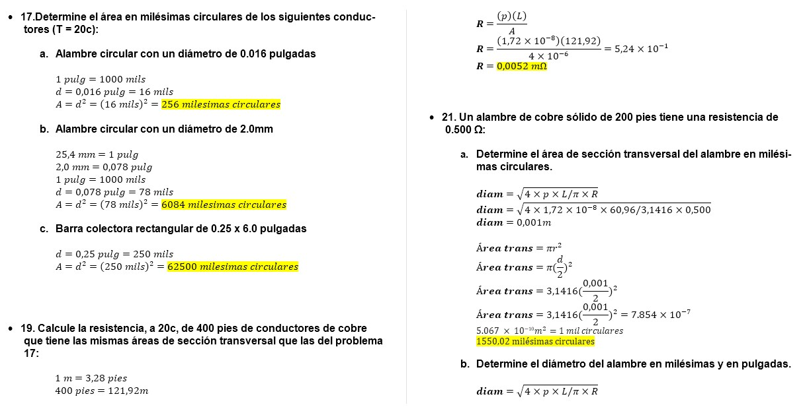
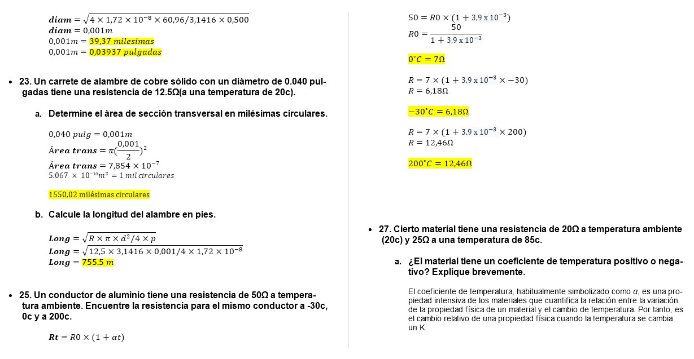
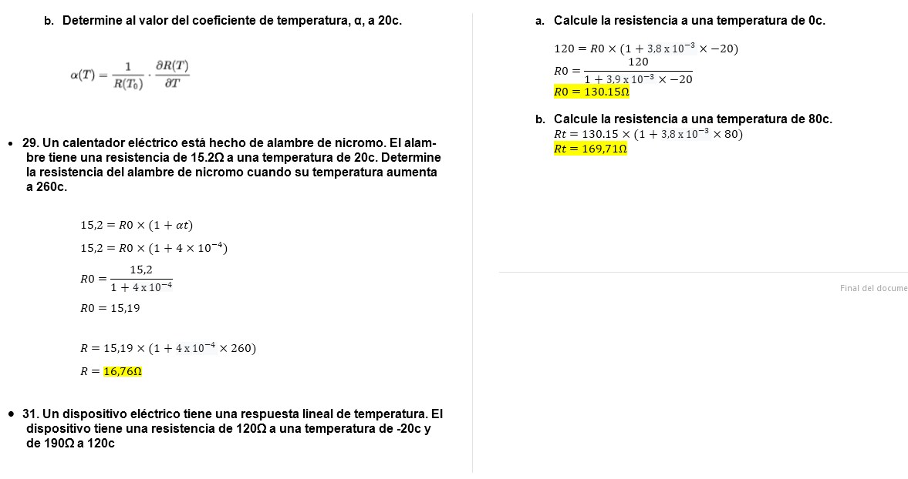
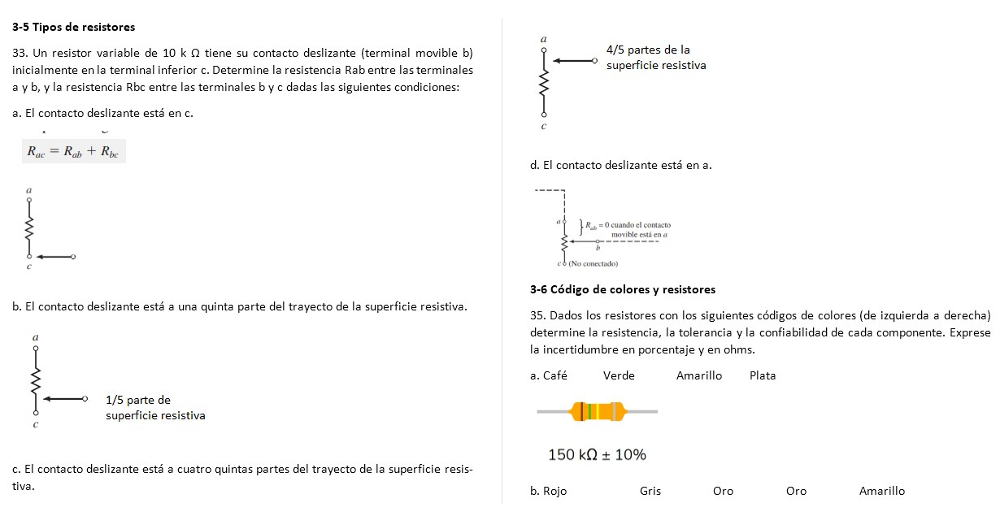
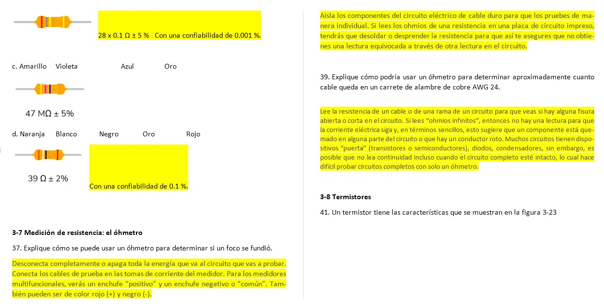
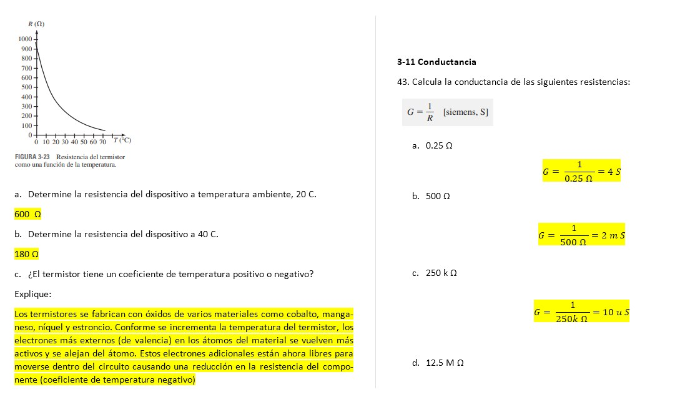
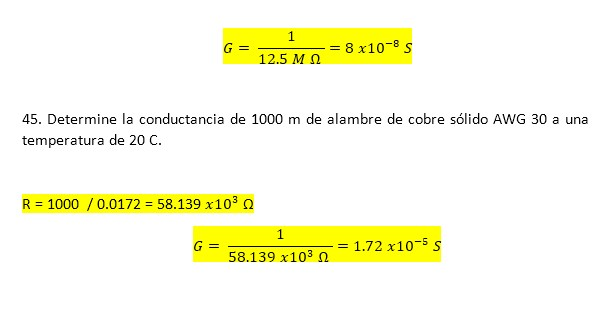

Resolución del capitulo 4 (ejercicios pares)

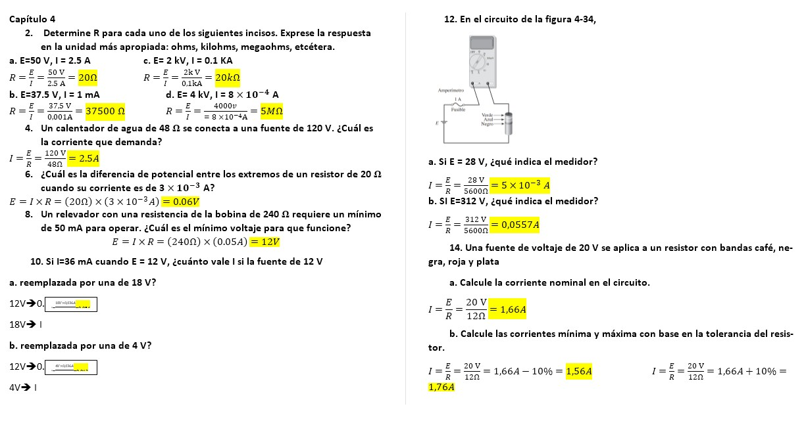
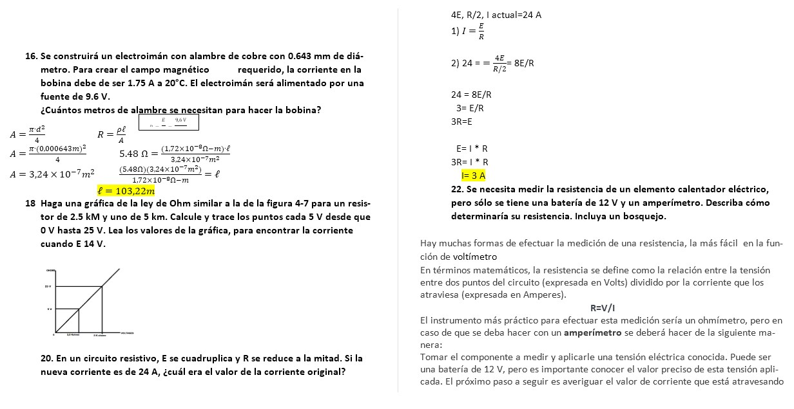
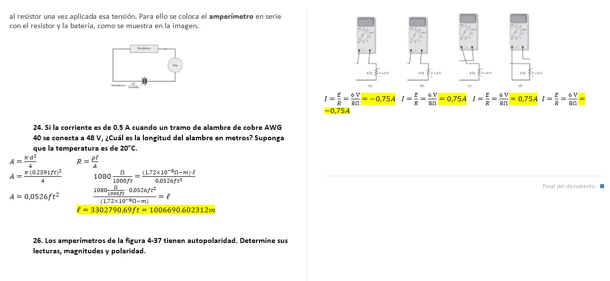
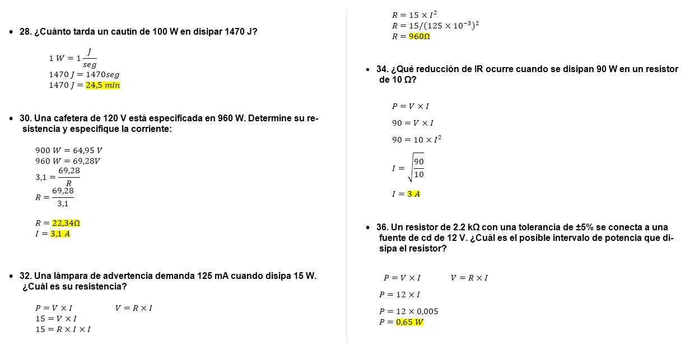
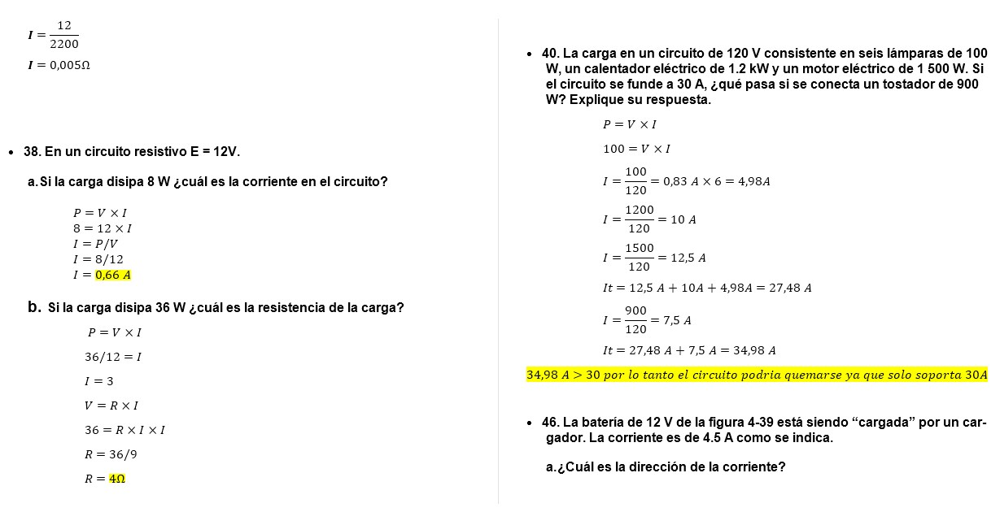
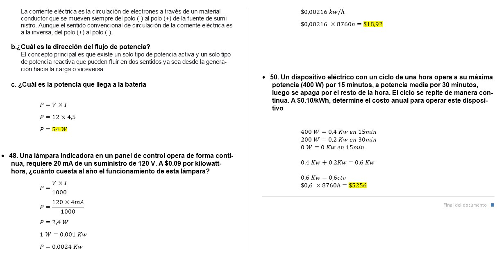
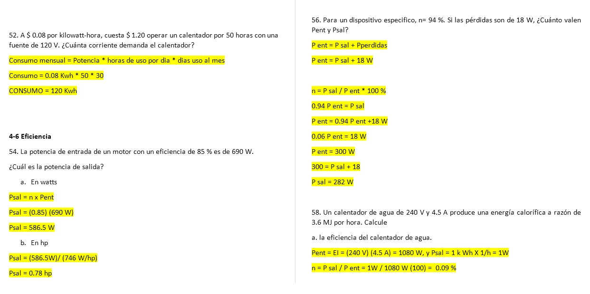
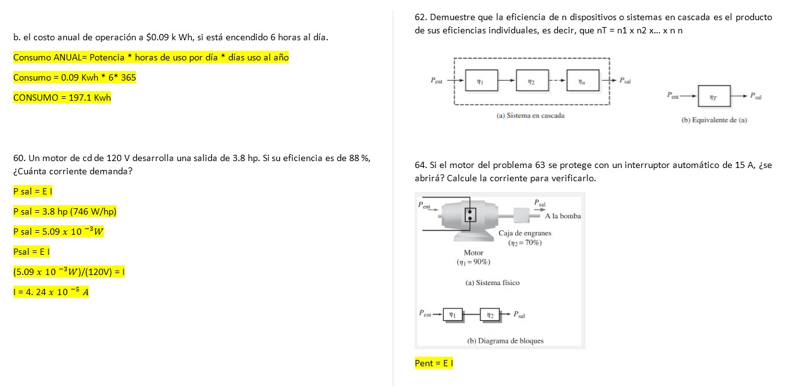
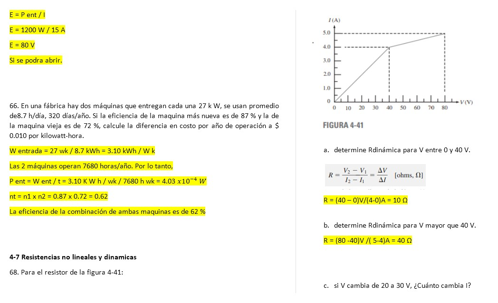
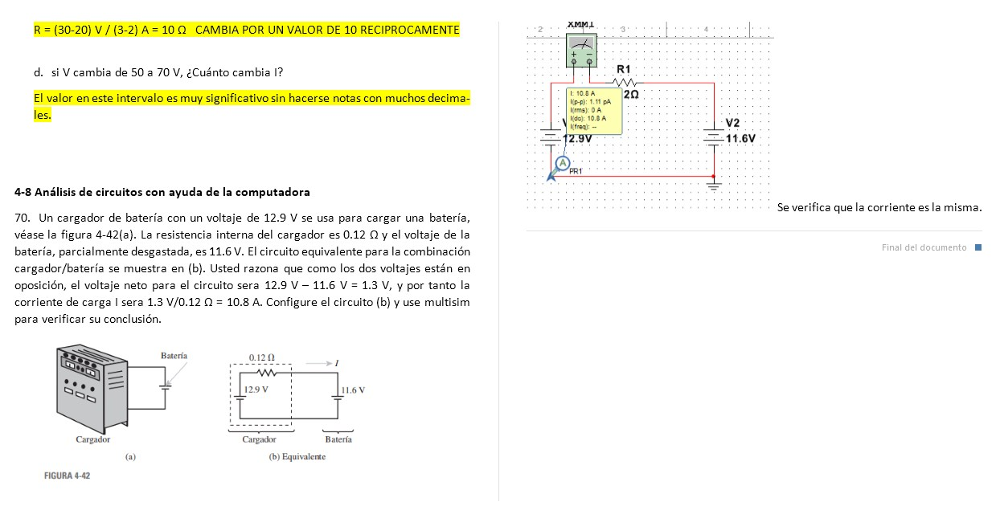

4. VIDEO

5. CONCLUSIONES

El trabajo realizado para la resolución del deber ha sido muy provechosa por varias razones, las cuales se resumen en esta conclusión. En primer lugar, se ha practicado el uso de conceptos de resistencia, ley de Ohm, potencia y energia, que es algo muy importante y que seguirá siendo provechoso en nuevas prácticas que se realicen en el futuro. Los conocimientos sobre la simbología, mediciones fueron llevados a la práctica y se ha observado cómo se puede expresar los valores calculados en distintas manera y cumple perfectamente siempre que se tome en cuenta las mediciones y transformaciones.
También se pudo ampliar el concepto de Ley de Ohm, tambien potencia y energia estableciendo relaciones entre estos valores en base a los ejercicios con los que se están trabajando en este deber. Un aprendizaje muy valioso que se obtuvo de este trabajo es que se tiene la forma en que se aplicaron los conceptos y propiedades que nos brindó el libro de Análisis de Circuitos de los capítulos 3 y 4 que fueron comprobadas, por medio de la resolución de los ejercicios. Se ha cumplido con los objetivos propuestos para este trabajo, y se desea que este reporte sea de provecho para aquellos que próximamente aplique sus conceptos.

6. BIBLIOGRAFÍA

Allan.H.Wilhelm.C.(2008). Análisis de circuitos teoría y práctica. Santa Fe, México: Cengage learning editores.
